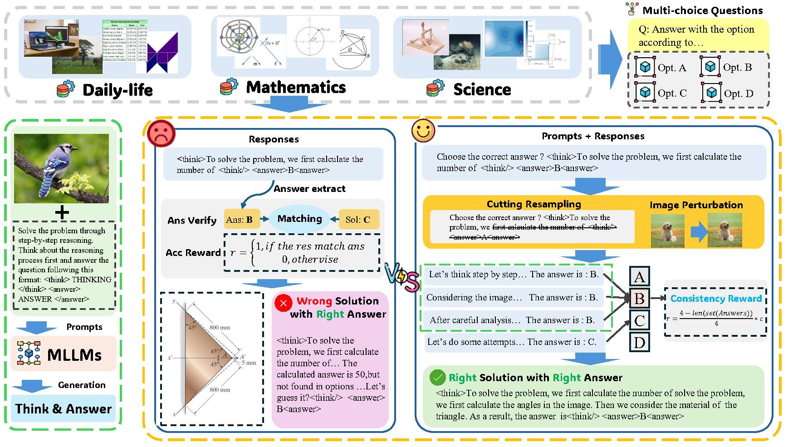

# [NeurIPS 2025] Enhancing the Outcome Reward-based RL Training of MLLMs with Self-Consistency Sampling

**A simple, general sampling method for RLVR with multi-choice dataset to solve unfaithful reasoning phenomenon!**

This repo is a fork of [**lmm-r1**](https://github.com/TideDra/lmm-r1).

# SCS Resouces

 [**📖 Paper**](https://arxiv.org/abs/2511.10648) | [**🤗 Dataset**](https://huggingface.co/datasets/GenuineWWD/SCS_data) | [**💻 Code**](https://github.com/GenuineWWD/SCS)


## 🔔News
- **🔥[2025-11-9] Release the eval codes! 🚀**
- **🔥[2025-10-13] Release the dataset the codes! 🚀**
- **🔥[2025-9-17] Our SCS paper is accepted by NeurIPS 2025! 🚀**
  
## To-do
- [x] Release the eval codes

## 📖 Introduction
**Self‑Consistency Sampling (SCS)** improves outcome‑reward reinforcement learning for multimodal large language models (MLLMs). In multiple‑choice reasoning tasks, models often get the correct answer through faulty reasoning and receive unmerited rewards. SCS mitigates this by introducing visual perturbations and repeated resampling of reasoning trajectories, rewarding only consistent reasoning paths. Integrated into methods like RLOO, GRPO, and REINFORCE++, SCS boosts accuracy by up to **7.7%** on six multimodal benchmarks with minimal extra cost, and generalizes across models including **Qwen2.5‑VL** and **InternVL3**.


## Training
### 📦Installation
```bash
git clone https://github.com/GenuineWWD/SCS.git
cd SCS
pip install -e .[vllm]
pip install flash_attn --no-build-isolation
```
### 📊Prepare dataset
#### Dataset Access
We publicly release the Training and evaluation dataset. Please refer to [**🤗 Dataset**](https://huggingface.co/datasets/GenuineWWD/SCS_data) and download our datasets. Please unzip all the data and modify the data path correctly in the jsonl file.
#### Preparing Your Custom Dataset
To ensure compatibility with our codebase, multimodal prompt datasets must be formatted in OpenAI-compatible message structures. We recommend organizing your data as a JSON Lines (JSONL) file with the .jsonl extension.
```json
[
  {
    "message":"[
      {
        \"role\": \"user\",
        \"content\": [
            { \
                \"type\": \"image\",
                \"image\": \"file:///path/to/your/image.jpg\",
            }, \
            {\"type\": \"text\", \"text\": \"<image>\\nHow many cats in the image?\"},
        ],
      }
    ]",
    "answer": "$3$"
  },
]
```
**Attention**
- ​**​Message Format​**​:  
  Ensure the `messages` field is a ​**​stringified​**​ list (e.g., `"[{\"role\": \"user\", \"content\": ...}]"`).

- ​**​Image-Tag Alignment​**​:  
  When training InternVL models, the number of `<image>\n` tags in the input text ​**​must exactly match​**​ the number of images provided in the message.

- ​**​Parameter Usage​**​:  
  - Use `--input_key {key_name}` to specify the JSON key containing the input data.  
  - For PPO training, provide data via `--prompt_data {name/path}`; for general training, use `--dataset {name/path}`.

- ​**​Multimodal Handling​**​:  
  - ​**​Do not​**​ enable `--apply_chat_template` for multimodal prompts—message parsing and image token insertion are handled internally by the framework.

### ⚙️Start training

You should modify the `CONFIG_SCRIPTS` variable in `examples/SCS/srun.sh` to run the specific trainning process.
For example, if you wand to train Qwen2.5-VL-7B-Instruct on RLOO method, you should set the `CONFIG_SCRIPTS` as `rloo_qwen2_5vl7b.sh`:
```bash

SCRIPT_DIR=$(dirname "$(readlink -f "$0")")

#############################
NNODES=1
GPU_PER_NODE=8
CPUS_PER_NODE=128
SCRIPT=$SCRIPT_DIR/train.sh

# rfpp_qwen2_5vl7b.sh, grpo_qwen2_5vl7b.sh, rfppbaseline_qwen2_5vl7b.sh, rloo_qwen2_5vl7b.sh, rloo_qwen2_5vl3b.sh, rloo_internvl3_8b.sh
CONFIG_SCRIPTS=rloo_qwen2_5vl7b.sh
#############################

export GPUS=$((GPU_PER_NODE * NNODES))

cd $(dirname $0)
mkdir -p $(dirname $0)/log
T=$(date +%Y%m%d%H%M)
LOG_PATH="log/srun_log_${T}.log"

srun -p Intern5 \
  --job-name=scs-rl \
  --ntasks=${NNODES} \
  --ntasks-per-node=1 \
  --gres=gpu:${GPU_PER_NODE} \
  --cpus-per-task=${CPUS_PER_NODE} \
  --kill-on-bad-exit=1 \
  -o $LOG_PATH \
  -e $LOG_PATH \
  --quotatype=reserved \
  bash $SCRIPT $CONFIG_SCRIPTS
```

Then, run the script like:
```bash
# Hardware Requirements: 8×80GB GPUs (e.g. A100/A800)
bash examples/SCS/srun.sh
```

## Evaluation
Please refer to [evaluation](evaluation/README.md) for more details.

## Contact
- Jiahao Wang: wjhwdscience@stu.xjtu.edu.cn
- Weiye Xu: ustcxwy0271@mail.ustc.edu.cn

## Citation

**BibTeX:**
```bibtex
@article{wang2025enhancing,
  title={Enhancing the Outcome Reward-based RL Training of MLLMs with Self-Consistency Sampling},
  author={Wang, Jiahao and Xu, Weiye and Yang, Aijun and Zhou, Wengang and Lu, Lewei and Li, Houqiang and Wang, Xiaohua and Zhu, Jinguo},
  journal={arXiv preprint arXiv:2511.10648},
  year={2025}
}
```
